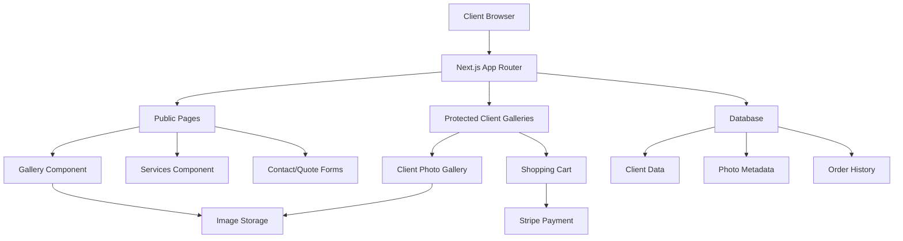
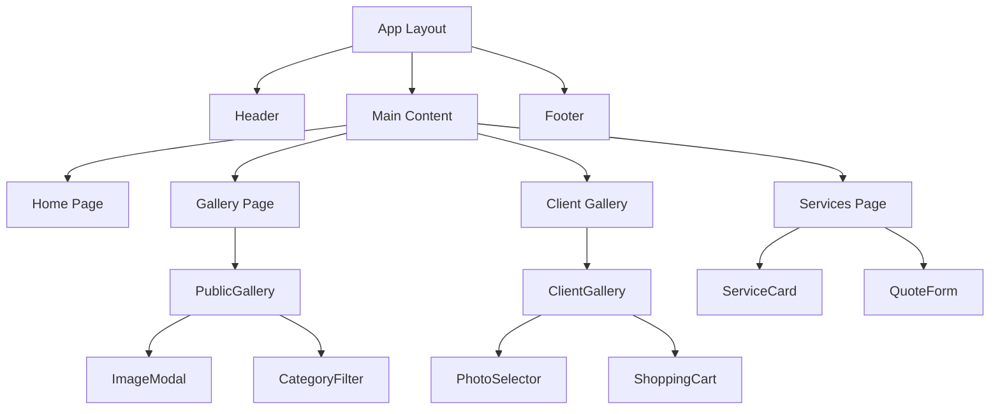

# Design Document

## Overview

The All Around Photos LLC website will be built as a modern, responsive web application using Next.js 15 with the App Router, React 19, and Tailwind CSS. The design prioritizes visual storytelling through high-quality photography across multiple service categories (portraits, events, aerial, pets), professional presentation, and seamless booking experience. The architecture supports both public-facing portfolio content and secure client galleries with e-commerce functionality for photo purchases.

## Architecture

### Technology Stack

- **Frontend Framework**: Next.js 15 with App Router
- **UI Framework**: React 19 with TypeScript
- **Styling**: Tailwind CSS with custom design system
- **Image Optimization**: Next.js built-in Image component with custom loader
- **Authentication**: NextAuth.js or Clerk if it's easier for client gallery access
- **Database**: PostgreSQL with Prisma ORM
- **Payment Processing**: Stripe for photo purchases
- **File Storage**: AWS S3 or Cloudinary for image assets with a stub for a NAS connection
- **Deployment**: Wrangler for optimal Next.js performance

### System Architecture



## Components and Interfaces

### Core Components

#### 1. Layout Components

- **Header**: Navigation with logo, menu items, and mobile hamburger
- **Footer**: Contact info, social links, certifications
- **Navigation**: Responsive menu with smooth transitions

#### 2. Gallery Components

- **PublicGallery**: Masonry-style grid with category filtering for different photography services
- **ImageModal**: Full-screen image viewer with session details and photography information
- **CategoryFilter**: Service type filtering (portraits, events, aerial sessions, pet photography)
- **ClientGallery**: Protected gallery with purchase options for session photos

#### 3. Service Components

- **ServiceCard**: Individual photography service presentation with session packages and pricing
- **ServiceDetail**: Expanded service information with session duration and deliverables
- **QuoteForm**: Multi-step form for photography session requests
- **BookingCalendar**: Available date/time selection for different session types
- **TestimonialSection**: Client reviews and feedback display

#### 4. E-commerce Components

- **PhotoSelector**: Checkbox selection for multiple photos
- **ShoppingCart**: Cart management with pricing calculations
- **CheckoutForm**: Stripe-integrated payment processing
- **DownloadManager**: Secure file delivery system

### Component Architecture



## Data Models

### Database Schema

#### User Model

```typescript
interface User {
  id: string;
  email: string;
  name: string;
  role: 'CLIENT' | 'ADMIN';
  createdAt: Date;
  updatedAt: Date;
  clientGalleries: ClientGallery[];
  orders: Order[];
}
```

#### Photo Model

```typescript
interface Photo {
  id: string;
  filename: string;
  title?: string;
  description?: string;
  category: 'PORTRAIT' | 'EVENT' | 'AERIAL' | 'PET' | 'OTHER';
  isPublic: boolean;
  metadata: PhotoMetadata;
  storageUrl: string;
  thumbnailUrl: string;
  watermarkUrl?: string;
  price: number;
  createdAt: Date;
  clientGalleries: ClientGallery[];
}
```

#### ClientGallery Model

```typescript
interface ClientGallery {
  id: string;
  name: string;
  accessCode: string;
  expiresAt?: Date;
  isActive: boolean;
  clientId: string;
  photos: Photo[];
  orders: Order[];
  createdAt: Date;
}
```

#### Order Model

```typescript
interface Order {
  id: string;
  clientId: string;
  galleryId: string;
  photos: Photo[];
  totalAmount: number;
  status: 'PENDING' | 'PAID' | 'DELIVERED';
  stripePaymentId: string;
  downloadLinks: DownloadLink[];
  createdAt: Date;
}
```

#### Service Model

```typescript
interface Service {
  id: string;
  name: string;
  description: string;
  category: 'PORTRAIT' | 'EVENT' | 'AERIAL' | 'PET';
  sessionDuration: string; // e.g., "1 hour", "30 minutes", "3 hours"
  locationCount: number; // number of locations included
  basePrice: number;
  features: string[];
  isActive: boolean;
}
```

#### Testimonial Model

```typescript
interface Testimonial {
  id: string;
  clientName: string;
  serviceType: string;
  content: string;
  rating?: number;
  isActive: boolean;
  createdAt: Date;
}
```

## User Interface Design

### Design System

#### Color Palette

- **Primary**: Deep blue (#1e40af) - Professional, trustworthy
- **Secondary**: Sky blue (#0ea5e9) - Modern, aerial theme
- **Accent**: Orange (#f97316) - Call-to-action, energy
- **Neutral**: Gray scale (#f8fafc to #1e293b)
- **Success**: Green (#10b981)
- **Warning**: Amber (#f59e0b)

#### Typography

- **Headings**: Inter font family, bold weights
- **Body**: Inter font family, regular/medium weights
- **Accent**: Playfair Display for elegant touches

#### Responsive Breakpoints

- **Mobile**: 320px - 767px
- **Tablet**: 768px - 1023px
- **Desktop**: 1024px - 1439px
- **Large Desktop**: 1440px+

### Page Layouts

#### Homepage

- Hero section with photography showcase and compelling tagline
- Featured work carousel highlighting different photography services
- Service overview cards (Portraits, Events, Aerial Sessions, Pet Sessions)
- Client testimonials with names and service feedback
- Facebook group integration and social proof
- Contact call-to-action for bookings

#### Gallery Page

- Category filter navigation
- Masonry grid layout (responsive columns)
- Infinite scroll or pagination
- Image modal with metadata
- Mobile-optimized touch interactions

#### Services Page

- Service category sections (Portraits, Events, Aerial Sessions, Pet Sessions)
- Detailed service cards with session duration, location options, and pricing
- Package comparisons (e.g., 1-hour vs 3-hour family sessions)
- Quote request forms for custom sessions
- Pet photography special considerations and preparation tips
- Aerial photography capabilities and unique perspectives showcase

#### Client Gallery

- Secure access with code entry
- Photo selection interface
- Shopping cart sidebar
- Checkout integration
- Download management

## Error Handling

### Client-Side Error Handling

- **Image Loading**: Fallback images and loading states
- **Form Validation**: Real-time validation with clear error messages
- **Network Errors**: Retry mechanisms and offline indicators
- **Payment Errors**: Clear error messaging and recovery options

### Server-Side Error Handling

- **API Errors**: Structured error responses with appropriate HTTP codes
- **Database Errors**: Connection pooling and retry logic
- **File Upload Errors**: Size and format validation
- **Authentication Errors**: Secure error messages without information leakage

### Error Monitoring

- **Logging**: Structured logging with error tracking
- **Monitoring**: Performance and error rate monitoring
- **Alerts**: Critical error notifications
- **Recovery**: Graceful degradation strategies

## Performance Optimization

### Image Optimization

- Next.js Image component with automatic optimization
- WebP/AVIF format support with fallbacks
- Responsive image sizing
- Lazy loading for gallery images
- CDN delivery for fast global access

### Code Optimization

- Bundle splitting and lazy loading
- Server-side rendering for SEO
- Static generation for marketing pages
- Edge caching strategies
- Compression and minification

### Database Optimization

- Indexed queries for fast photo retrieval
- Connection pooling
- Query optimization
- Caching strategies for frequently accessed data

## Security Considerations

### Authentication & Authorization

- Secure client gallery access codes
- JWT token management
- Role-based access control
- Session management

### Data Protection

- HTTPS enforcement
- Input validation and sanitization
- SQL injection prevention
- XSS protection
- CSRF protection

### File Security

- Secure file upload validation
- Watermarked preview images
- Signed URLs for downloads
- Access control for client galleries

## Testing Strategy

### Unit Testing

- Component testing with React Testing Library
- Utility function testing
- Database model testing
- API endpoint testing

### Integration Testing

- End-to-end user flows
- Payment processing testing
- File upload/download testing
- Authentication flow testing

### Performance Testing

- Image loading performance
- Gallery rendering performance
- Mobile responsiveness testing
- Cross-browser compatibility

### Security Testing

- Authentication bypass testing
- File access control testing
- Input validation testing
- Payment security testing

## SEO and Accessibility

### SEO Optimization

- Server-side rendering for search engines
- Structured data markup for rich snippets
- Optimized meta tags and descriptions
- XML sitemap generation
- Fast loading times and Core Web Vitals

### Accessibility

- WCAG 2.1 AA compliance
- Keyboard navigation support
- Screen reader compatibility
- Alt text for all images
- Color contrast compliance
- Focus management for modals

## Deployment and DevOps

### Development Workflow

- Git-based version control
- Feature branch development
- Code review process
- Automated testing pipeline
- Staging environment testing

### Production Deployment

- Vercel deployment for optimal Next.js performance
- Environment variable management
- Database migration strategies
- CDN configuration
- SSL certificate management

### Monitoring and Maintenance

- Application performance monitoring
- Error tracking and alerting
- Database backup strategies
- Security update procedures
- Content management workflows
